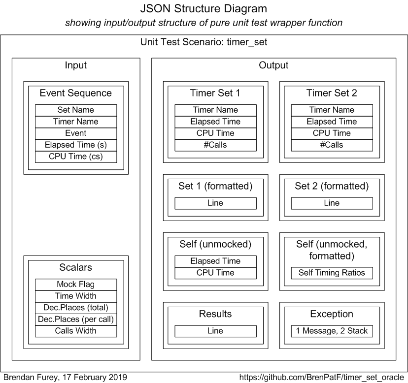
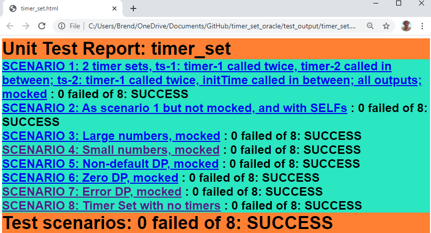

# Timer_Set

Oracle PL/SQL code timing module.

:stopwatch:

Oracle PL/SQL package that facilitates code timing for instrumentation and other purposes, with very small footprint in both code and resource usage. Construction and reporting require only a single line each, regardless of how many timers are included in a set.

See [Code Timing and Object Orientation and Zombies](http://www.scribd.com/doc/43588788/Code-Timing-and-Object-Orientation-and-Zombies), November 2010, for the original idea implemented in Oracle PL/SQL, Perl and Java.

The package is tested using the Math Function Unit Testing design pattern, with test results in HTML and text format included. See test_output\timer_set.html for the unit test results root page.

## In this README...
- [Usage (extract from main_col_group.sql)](https://github.com/BrenPatF/timer_set_oracle#usage-extract-from-main_col_groupsql)
- [API - Timer_Set](https://github.com/BrenPatF/timer_set_oracle#api---timer_set)
- [Installation](https://github.com/BrenPatF/timer_set_oracle#installation)
- [Unit Testing](https://github.com/BrenPatF/timer_set_oracle#unit-testing)
- [Operating System/Oracle Versions](https://github.com/BrenPatF/timer_set_oracle#operating-systemoracle-versions)

## Usage (extract from main_col_group.sql)
- [In this README...](https://github.com/BrenPatF/timer_set_oracle#in-this-readme)
```sql
DECLARE
  l_timer_set   PLS_INTEGER := Timer_Set.Construct('Col Group');

BEGIN

  Col_Group.Load_File(p_file   => 'fantasy_premier_league_player_stats.csv', 
                      p_delim  => ',', 
                      p_colnum => 7);
  Timer_Set.Increment_Time(l_timer_set, 'Load File');
.
.
.
  Print_Results('Sorted by Value, Key', Col_Group.Sort_By_Value);
  Timer_Set.Increment_Time(l_timer_set, 'Sort_By_Value');
  Utils.W(p_line_lis => Timer_Set.Format_Results(l_timer_set));
```
This will create a timer set and time the sections, with listing at the end:
```
Timer Set: Col Group, Constructed at 26 Jan 2019 14:16:12, written at 14:16:12
==============================================================================
Timer             Elapsed         CPU       Calls       Ela/Call       CPU/Call
-------------  ----------  ----------  ----------  -------------  -------------
Load File            0.18        0.08           1        0.17500        0.08000
List_Asis            0.00        0.00           1        0.00100        0.00000
Sort_By_Key          0.00        0.00           1        0.00000        0.00000
Sort_By_Value        0.00        0.00           1        0.00000        0.00000
(Other)              0.00        0.00           1        0.00000        0.00000
-------------  ----------  ----------  ----------  -------------  -------------
Total                0.18        0.08           5        0.03520        0.01600
-------------  ----------  ----------  ----------  -------------  -------------
[Timer timed (per call in ms): Elapsed: 0.01124, CPU: 0.01011]
```
To run the example in a slqplus session from app subfolder (after installation):

SQL> @main_col_group

There is also a separate [module](https://github.com/BrenPatF/oracle_plsql_api_demos) demonstrating instrumentation and logging, code timing and unit testing of Oracle PL/SQL APIs.

## API - Timer_Set
- [In this README...](https://github.com/BrenPatF/timer_set_oracle#in-this-readme)
- [Construct(p_ts_name)](https://github.com/BrenPatF/timer_set_oracle#l_timer_set---pls_integer--timer_setconstructp_ts_name)
- [Increment_Time(p_timer_set, p_timer_name)](https://github.com/BrenPatF/timer_set_oracle#timer_setincrement_timep_timer_set-p_timer_name)
- [Init_Time(p_timer_set)](https://github.com/BrenPatF/timer_set_oracle#timer_setinit_timep_timer_set)
- [Get_Timers(p_timer_set)](https://github.com/BrenPatF/timer_set_oracle#timer_setget_timersp_timer_set)
- [Format_Timers(p_timer_set, p_format_prms)](https://github.com/BrenPatF/timer_set_oracle#timer_setformat_timersp_timer_set-p_format_prms)
- [Get_Self_Timer](https://github.com/BrenPatF/timer_set_oracle#timer_setget_self_timer)
- [Format_Self_Timer(p_format_prms)](https://github.com/BrenPatF/timer_set_oracle#timer_setformat_self_timerp_format_prms)
- [Format_Results(p_timer_set, p_format_prms)](https://github.com/BrenPatF/timer_set_oracle#timer_setformat_resultsp_timer_set-p_format_prms)
### l_timer_set   PLS_INTEGER := Timer_Set.Construct(p_ts_name)
Constructs a new timer set with name `p_ts_name`, and integer handle `l_timer_set`.

### Timer_Set.Increment_Time(p_timer_set, p_timer_name)
Increments the timing statistics (elapsed, user and system CPU, and number of calls) for a timer `p_timer_name` within the timer set `p_timer_set` with the times passed since the previous call to Increment_Time, Init_Time or the constructor of the timer set instance. Resets the statistics for timer set `p_timer_set` to the current time, so that the next call to increment_time measures from this point for its increment.

### Timer_Set.Init_Time(p_timer_set)
Resets the statistics for timer set `p_timer_set` to the current time, so that the next call to increment_time measures from this point for its increment. This is only used where there are gaps between sections to be timed.

### Timer_Set.Get_Timers(p_timer_set)
- [API - Timer_Set](https://github.com/BrenPatF/timer_set_oracle#api---timer_set)

Returns the results for timer set `p_timer_set` in an array of records of type `Timer_Set.timer_stat_rec`, with fields:

* `name`: timer name
* `ela_secs`: elapsed time in seconds
* `cpu_secs`: CPU time in seconds
* `calls`: number of calls

After a record for each named timer, in order of creation, there are two calculated records:

* `Other`: differences between `Total` values and the sums of the named timers
* `Total`: totals calculated from the times at timer set construction

### Timer_Set.Format_Timers(p_timer_set, p_format_prms)
- [API - Timer_Set](https://github.com/BrenPatF/timer_set_oracle#api---timer_set)

Returns the results for timer set `p_timer_set` in an array of formatted strings, including column headers and formatting lines, with fields as in Get_Timers, times in seconds, and per call values added, with p_format_prms record parameter of type `Timer_Set.format_prm_rec` and default `Timer_Set.FORMAT_PRMS_DEF`:

* `time_width`: width of time fields (excluding decimal places), default 8
* `time_dp`: decimal places to show for absolute time fields, default 2
* `time_ratio_dp`: decimal places to show for per call time fields, default 5
* `calls_width`: width of calls field, default 10

### Timer_Set.Get_Self_Timer
- [API - Timer_Set](https://github.com/BrenPatF/timer_set_oracle#api---timer_set)

Static method to time the Increment_Time method as a way of estimating the overhead in using the timer set. Constructs a timer set instance and calls Increment_Time on it within a loop until 0.1s has elapsed.

Returns a tuple, with fields:

* `ela`: elapsed time per call in ms
* `cpu`: CPU time per call in ms

### Timer_Set.Format_Self_Timer(p_format_prms)
Static method to return the results from Get_Self_Timer in a formatted string, with parameter as Format_Timers (but any extra spaces are trimmed here).

### Timer_Set.Format_Results(p_timer_set, p_format_prms)
- [API - Timer_Set](https://github.com/BrenPatF/timer_set_oracle#api---timer_set)

Returns the results for timer set `p_timer_set` in a formatted string, with parameters as Format_Timers. It uses the array returned from Format_Timers and includes a header line with timer set construction and writing times, and a footer of the self-timing values.

## Installation
- [In this README...](https://github.com/BrenPatF/timer_set_oracle#in-this-readme)
- [Install 1: Install prerequisite modules](https://github.com/BrenPatF/timer_set_oracle#install-1-install-prerequisite-modules)
- [Install 2: Create Timer_Set components](https://github.com/BrenPatF/timer_set_oracle#install-2-create-timer_set-components)
- [Install 3: Create synonyms to lib](https://github.com/BrenPatF/timer_set_oracle#install-3-create-synonyms-to-lib)
- [Install 4: Install unit test code](https://github.com/BrenPatF/timer_set_oracle#install-4-install-unit-test-code)

The install depends on the prerequisite modules Utils and Trapit (unit testing only) and `lib` and `app` schemas refer to the schemas in which Utils and examples are installed, respectively.

### Install 1: Install prerequisite modules
- [Installation](https://github.com/BrenPatF/timer_set_oracle#installation)

The prerequisite modules can be installed by following the instructions at [Utils on GitHub](https://github.com/BrenPatF/oracle_plsql_utils). This allows inclusion of the examples and unit tests for the modules. Alternatively, the next section shows how to install the modules directly without their examples or unit tests here (but with the Trapit module required for unit testing the Timer_Set module).

#### [Schema: sys; Folder: install_prereq] Create lib and app schemas and Oracle directory
install_sys.sql creates an Oracle directory, `input_dir`, pointing to 'c:\input'. Update this if necessary to a folder on the database server with read/write access for the Oracle OS user
- Run script from slqplus:
```
SQL> @install_sys
```

#### [Folder: install_prereq] Copy example csv file to input folder
- Copy the following file from the install_prereq folder to the server folder pointed to by the Oracle directory INPUT_DIR:
    - fantasy_premier_league_player_stats.csv

- There is also a bash script to do this, assuming C:\input as INPUT_DIR:
```
$ ./cp_csv_to_input.ksh
```

#### [Schema: lib; Folder: install_prereq\lib] Create lib components
- Run script from slqplus:
```
SQL> @install_lib_all
```
#### [Schema: app; Folder: install_prereq\app] Create app synonyms and install example package
- Run script from slqplus:
```
SQL> @install_app_all
```
#### [Folder: (npm root)] Install npm trapit package
The npm trapit package is a nodejs package used to format unit test results as HTML pages.

Open a DOS or Powershell window in the folder where you want to install npm packages, and, with [nodejs](https://nodejs.org/en/download/) installed, run
```
$ npm install trapit
```
This should install the trapit nodejs package in a subfolder .\node_modules\trapit

### Install 2: Create Timer_Set components
- [Installation](https://github.com/BrenPatF/timer_set_oracle#installation)
#### [Schema: lib; Folder: lib]
- Run script from slqplus:
```
SQL> @install_timer_set app
```
This creates the required components for the base install along with grants for them to the app schema (passing none instead of app will bypass the grants). This install is all that is required to use the package within the lib schema and app (if passed, and then Install 3 is required). To grant privileges to another `schema`, run the grants script directly, passing `schema`:
```
SQL> @grant_timer_set_to_app schema
```

### Install 3: Create synonyms to lib
- [Installation](https://github.com/BrenPatF/timer_set_oracle#installation)
#### [Schema: app; Folder: app]
- Run script from slqplus:
```
SQL> @c_timer_set_syns lib
```
This install creates private synonyms to the lib schema. To create synonyms within another schema, run the synonyms script directly from that schema, passing lib schema.

### Install 4: Install unit test code
- [Installation](https://github.com/BrenPatF/timer_set_oracle#installation)

This step requires the Trapit module option to have been installed as part of Install 1.

#### [Folder: (module root)] Copy unit test JSON file to input folder
- Copy the following file from the root folder to the server folder pointed to by the Oracle directory INPUT_DIR:
  - tt_timer_set.test_api_inp.json

- There is also a bash script to do this, assuming C:\input as INPUT_DIR:
```
$ ./cp_json_to_input.ksh
```

#### [Schema: lib; Folder: lib] Install unit test code
- Run script from slqplus:
```
SQL> @install_timer_set_tt
```

## Unit Testing
- [In this README...](https://github.com/BrenPatF/timer_set_oracle#in-this-readme)
- [Wrapper Function Diagram](https://github.com/BrenPatF/timer_set_oracle#wrapper-function-diagram)
- [Unit Test Summary Page](https://github.com/BrenPatF/timer_set_oracle#unit-test-summary-page)

The unit test program (if installed) may be run from the lib subfolder:

SQL> @r_tests

The program is data-driven from the input file tt_timer_set.test_api_inp.json and produces an output file tt_timer_set.test_api_out.json, that contains arrays of expected and actual records by group and scenario.

The output file is processed by a nodejs program that has to be installed separately from the `npm` nodejs repository, as described in the Trapit install in `Install 1` above. The nodejs program produces listings of the results in HTML and/or text format, and a sample set of listings is included in the subfolder test_output. To run the processor (in Windows), open a DOS or Powershell window in the trapit package folder after placing the output JSON file, tt_timer_set.test_api_out.json, in the subfolder ./examples/externals and run:
```
$ node ./examples/externals/test-externals
```
The three testing steps can easily be automated in Powershell (or Unix bash).

The package is tested using the Math Function Unit Testing design pattern (`See also - Trapit` below). In this approach, a 'pure' wrapper function is constructed that takes input parameters and returns a value, and is tested within a loop over scenario records read from a JSON file.

The wrapper function represents a generalised transactional use of the package in which multiple timer sets may be constructed, and then timings carried out and reported on at the end of the transaction. 

This kind of package would usually be thought hard to unit-test, with CPU and elapsed times being inherently non-deterministic. However, this is a good example of the power of the design pattern that I recently introduced: One of the inputs is a yes/no flag indicating whether to mock the system timing calls, or not. The timer set `Construct` method takes as an optional parameter an array containing a stream of mocked elapsed and  CPU times read from the input scenario data. 

In the non-mocked scenarios standard function calls are made to return elapsed and epochal CPU times, while in the mocked scenarios these are bypassed, and deterministic values read from the input array.

In this way we can test correctness of the timing aggregations, independence of timer sets etc. using the deterministic values; on the other hand, one of the key benefits of automated unit testing is to test the actual dependencies, and we do this in the non-mocked case by passing in 'sleep' times to the wrapper function and testing the outputs against ranges of values.

### Wrapper Function Diagram
- [Unit Testing](https://github.com/BrenPatF/timer_set_oracle#unit-testing)

This diagram shows the input/output structure of the pure unit test wrapper function:


### Unit Test Summary Page
- [Unit Testing](https://github.com/BrenPatF/timer_set_oracle#unit-testing)

This is an image of the unit test summary page, and it shows the scenarios tested.


You can review the formatted unit test results obtained by the author here, [Unit Test Report: timer_set](http://htmlpreview.github.io/?https://github.com/BrenPatF/timer_set_oracle/blob/master/test_output/timer_set.html), and the files are available in the `test_output` subfolder [timer_set.html is the root page for the HTML version and timer_set.txt has the results in text format].

## Operating System/Oracle Versions
- [In this README...](https://github.com/BrenPatF/timer_set_oracle#in-this-readme)
### Windows
Windows 10, should be OS-independent
### Oracle
- Tested on Oracle Database Version 18.3.0.0.0
- Base code (and example) should work on earlier versions at least as far back as v10 and v11

## See also
- [Utils - Oracle PL/SQL general utilities module](https://github.com/BrenPatF/oracle_plsql_utils)
- [Trapit - Oracle PL/SQL unit testing module](https://github.com/BrenPatF/trapit_oracle_tester)
- [timer_set - Oracle logging module](https://github.com/BrenPatF/timer_set_oracle)
- [Trapit - nodejs unit test processing package](https://github.com/BrenPatF/trapit_nodejs_tester)
- [Oracle PL/SQL API Demos - demonstrating instrumentation and logging, code timing and unit testing of Oracle PL/SQL APIs](https://github.com/BrenPatF/oracle_plsql_api_demos)
- [Code Timing and Object Orientation and Zombies, Brendan Furey, November 2010](http://www.scribd.com/doc/43588788/Code-Timing-and-Object-Orientation-and-Zombies)
   
## License
MIT