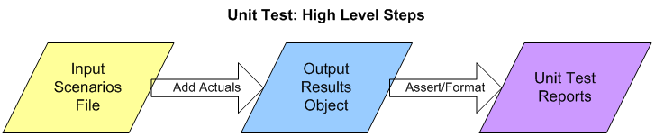

Oracle PL/SQL code timing module.

:stopwatch:

Oracle PL/SQL package that facilitates code timing for instrumentation and other purposes, with very small footprint in both code and resource usage. Construction and reporting require only a single line of code each, regardless of how many timers are included in a set, and usually only a single timing line is needed per section timed.

Multiple timer sets can be created and run independently, allowing for timing at multiple levels simultaneously, and for use across multiple modules without conflicts.

See [Code Timing and Object Orientation and Zombies](http://www.scribd.com/doc/43588788/Code-Timing-and-Object-Orientation-and-Zombies), November 2010, for the original idea implemented in Oracle PL/SQL, Perl and Java.

Usage is demonstrated by an example calling a simple file-reading and group-counting package.

The module is tested using [The Math Function Unit Testing Design Pattern](https://brenpatf.github.io/2023/06/05/the-math-function-unit-testing-design-pattern.html), with test results in HTML and text format included.

# In This README...
[&darr; Usage](#usage)<br />
[&darr; API - Timer_Set](#api---timer_set)<br />
[&darr; Installation](#installation)<br />
[&darr; Unit Testing](#unit-testing)<br />
[&darr; Folder Structure](#folder-structure)<br />
[&darr; See Also](#see-also)<br />
## Usage
[&uarr; In This README...](#in-this-readme)<br />

There is a script in the `app` subfolder, main_col_group.sql, that demonstrates basic usage:

```sql
DECLARE
  l_timer_set   PLS_INTEGER := Timer_Set.Construct('Col Group');

BEGIN

  Col_Group.Load_File(p_file   => 'fantasy_premier_league_player_stats.csv',
                      p_delim  => ',',
                      p_colnum => 7);
  Timer_Set.Increment_Time(l_timer_set, 'Load File');
.
.
.
  Print_Results('Sorted by Value, Key', Col_Group.Sort_By_Value);
  Timer_Set.Increment_Time(l_timer_set, 'Sort_By_Value');
  Utils.W(p_line_lis => Timer_Set.Format_Results(l_timer_set));

```
This will create a timer set and time the sections, with listing at the end:

```
Timer Set: Col Group, Constructed at 26 Jan 2019 14:16:12, written at 14:16:12
==============================================================================
Timer             Elapsed         CPU       Calls       Ela/Call       CPU/Call
-------------  ----------  ----------  ----------  -------------  -------------
Load File            0.18        0.08           1        0.17500        0.08000
List_Asis            0.00        0.00           1        0.00100        0.00000
Sort_By_Key          0.00        0.00           1        0.00000        0.00000
Sort_By_Value        0.00        0.00           1        0.00000        0.00000
(Other)              0.00        0.00           1        0.00000        0.00000
-------------  ----------  ----------  ----------  -------------  -------------
Total                0.18        0.08           5        0.03520        0.01600
-------------  ----------  ----------  ----------  -------------  -------------
[Timer timed (per call in ms): Elapsed: 0.01124, CPU: 0.01011]
```
To run the example in a slqplus session from the app subfolder, after installation:

##### [Schema: app; Folder: app]
- Run script from slqplus:

```sql
SQL> @main_col_group
```

There is also a separate [module](https://github.com/BrenPatF/oracle_plsql_api_demos) demonstrating instrumentation and logging, code timing and unit testing of Oracle PL/SQL APIs.
## API - Timer_Set
[&uarr; In This README...](#in-this-readme)<br />
[&darr; Construct](#construct)<br />
[&darr; Increment_Time](#increment_time)<br />
[&darr; Init_Time](#init_time)<br />
[&darr; Get_Timers](#get_timers)<br />
[&darr; Format_Timers](#format_timers)<br />
[&darr; Get_Self_Timer](#get_self_timer)<br />
[&darr; Format_Self_Timer](#format_self_timer)<br />
[&darr; Format_Results](#format_results)<br />

### Construct
[&uarr; API - Timer_Set](#api---timer_set)<br />
```sql
 l_timer_set   PLS_INTEGER := Timer_Set.Construct(p_ts_name, p_mock_time_lis);
```
Constructs a new timer set with name `p_ts_name`, and integer handle `l_timer_set`, with parameters:

- `p_ts_name`: timer set name
- `p_mock_time_lis`: optional list of mocked timings in an array of records of type `Timer_Set.timer_stat_rec`, with fields:
	- `name`: timer name
	- `ela_secs`: elapsed time in seconds
	- `cpu_secs`: CPU time in seconds
	- `calls`: number of calls

Return value:

- `[PLS_INTEGER]`: timer set id

### Increment_Time
[&uarr; API - Timer_Set](#api---timer_set)<br />
```sql
Timer_Set.Increment_Time(p_timer_set, p_timer_name);
```
Increments the timing statistics (elapsed, user and system CPU, and number of calls) for a timer `p_timer_name` within the timer set `p_timer_set` with the times passed since the previous call to Increment_Time, Init_Time or the constructor of the timer set instance. Resets the statistics for timer set `p_timer_set` to the current time, so that the next call to Increment_Time measures from this point for its increment. The parameters are:

- `p_timer_set`: timer set id
- `p_timer_name`: timer name

### Init_Time
[&uarr; API - Timer_Set](#api---timer_set)<br />
```sql
Timer_Set.Init_Time(p_timer_set);
```
Resets the statistics for timer set `p_timer_set` to the current time, so that the next call to Increment_Time measures from this point for its increment. This is only used where there are gaps between sections to be timed. The parameter is:

- `p_timer_set`: timer set id

### Get_Timers
[&uarr; API - Timer_Set](#api---timer_set)<br />
```sql
l_timer_stat_arr timer_stat_arr := Timer_Set.Get_Timers(p_timer_set);
```
Returns the results for timer set `p_timer_set` in an array of records, with parameter:

- `p_timer_set`: timer set id

Return value:

- `[timer_stat_arr]`: an array of records of type `Timer_Set.timer_stat_rec`, with fields:
	- `name`: timer name
	- `ela_secs`: elapsed time in seconds
	- `cpu_secs`: CPU time in seconds
	- `calls`: number of calls

After a record for each named timer, in order of creation, there are two calculated records:

- `Other`: differences between `Total` values and the sums of the named timers
- `Total`: totals calculated from the times at timer set construction

### Format_Timers
[&uarr; API - Timer_Set](#api---timer_set)<br />
```sql
l_formatted_times_lis L1_chr_arr := Timer_Set.Format_Timers(p_timer_set, p_format_prms);
```
Returns the results for timer set `p_timer_set` in an array of formatted strings, including column headers and formatting lines, with fields as in Get_Timers, times in seconds, and per call values added, with parameters:

- `p_timer_set`: timer set id
- `[p_format_prms]`: a record of type `Timer_Set.format_prm_rec`, with fields:
	- `time_width`: width of time fields (excluding decimal places), default 8
	- `time_dp`: decimal places to show for absolute time fields, default 2
	- `time_ratio_dp`: decimal places to show for per call time fields, default 5
	- `calls_width`: width of calls field, default 10

Return value:
- `[L1_chr_arr]`: an array of formatted strings

### Get_Self_Timer
[&uarr; API - Timer_Set](#api---timer_set)<br />
```sql
l_self_times_lis L1_num_arr := Timer_Set.Get_Self_Timer;
```
Static method to time the Increment_Time method as a way of estimating the overhead in using the timer set. Constructs a timer set instance and calls Increment_Time on it within a loop until 0.1s has elapsed.

Return value:
- `[L1_num_arr]`: an array of numbers, with two elements:
	- `[1]`: elapsed time per call in ms
	- `[2]`: CPU time per call in ms

### Format_Self_Timer
[&uarr; API - Timer_Set](#api---timer_set)<br />
```sql
l_self_times VARCHAR2(4000) := Timer_Set.Format_Self_Timer(p_format_prms);
```
Static method to return the results from Get_Self_Timer in a formatted string, with parameter:

- `[p_format_prms]`: a record of type `Timer_Set.format_prm_rec`, with fields:
	- `time_width`: width of time fields (excluding decimal places), default 8
	- `time_dp`: decimal places to show for absolute time fields, default 2
	- `time_ratio_dp`: decimal places to show for per call time fields, default 5
	- `calls_width`: width of calls field, default 10

Return value:

* `[VARCHAR2]`: formatted string with elapsed and CPU times per call in milliseconds

### Format_Results
[&uarr; API - Timer_Set](#api---timer_set)<br />
```sql
l_formatted_times_lis L1_chr_arr := Timer_Set.Format_Results(p_timer_set, p_format_prms);
```
Returns the results for timer set `p_timer_set` in a list of formatted strings. It uses the array returned from Format_Timers and includes a header line with timer set construction and writing times, and a footer of the self-timing values, with parameters:

- `p_timer_set`: timer set id
- `[p_format_prms]`: a record of type `Timer_Set.format_prm_rec`, with fields:
	- `time_width`: width of time fields (excluding decimal places), default 8
	- `time_dp`: decimal places to show for absolute time fields, default 2
	- `time_ratio_dp`: decimal places to show for per call time fields, default 5
	- `calls_width`: width of calls field, default 10

Return value:
- `[L1_chr_arr]`: an array of formatted strings
## Installation
[&uarr; In This README...](#in-this-readme)<br />
[&darr; Prerequisite Applications](#prerequisite-applications)<br />
[&darr; Oracle Installs](#oracle-installs)<br />
[&darr; Powershell and JavaScript Packages](#powershell-and-javascript-packages)<br />

### Prerequisite Applications
[&uarr; Installation](#installation)<br />
[&darr; Oracle Client](#oracle-client)<br />
[&darr; Node.js](#nodejs)<br />
[&darr; Powershell](#powershell)<br />

#### Oracle Client
[&uarr; Prerequisite Applications](#prerequisite-applications)<br />

An Oracle client is required, including SQL\*Plus, with access to an Oracle database:

- [Oracle Instant Client Downloads for Microsoft Windows (x64) 64-bit](https://www.oracle.com/ie/database/technologies/instant-client/winx64-64-downloads.html)

#### Node.js
[&uarr; Prerequisite Applications](#prerequisite-applications)<br />

The unit test results are formatted using a JavaScript program, which is included as part of the current project. Running the program requires the Node.js application:

- [Node.js Downloads](https://nodejs.org/en/download)

#### Powershell
[&uarr; Prerequisite Applications](#prerequisite-applications)<br />

Powershell is optional, and is used in the project for automation purposes, and for generating a template for the JSON input file required by [The Math Function Unit Testing Design Pattern](https://brenpatf.github.io/2023/06/05/the-math-function-unit-testing-design-pattern.html). It comes pre-installed on Windows systems, but here are the installation instructions if needed:

- [Installing Windows PowerShell](https://learn.microsoft.com/en-us/powershell/scripting/windows-powershell/install/installing-windows-powershell)


### Oracle Installs
[&uarr; Installation](#installation)<br />
[&darr; Automated Installation](#automated-installation)<br />
[&darr; Manual Installation](#manual-installation)<br />

The Oracle installation can be performed via a single powershell script, or in a series of smaller steps.

#### Automated Installation
[&uarr; Oracle Installs](#oracle-installs)<br />

The Oracle installation can be performed simply by running the following script, Install-Timer_Set.ps1:

##### [Folder: (module root)]

```powershell
.\Install-Timer_Set
```

Some points to note:
- This script copies two files to a folder 'c:/input', creating it if it does not exist, and aborting if it exists as a file
- It creates lib and app schemas using sys schema, with all passwords assumed to be the  usernames, and TNS alias orclpdb
- It creates an Oracle directory INPUT_DIR pointing to 'c:/input'
- It runs a script drop_utils_users.sql first to drop those schemas if they exist, but this is commented out in the GitHub version
- The three schemas and the directory folder can all be set to different values by updating the variable assignments in the script

##### Install-Timer_Set.ps1
The powershell script calls a library function, Install-OracleApp, included in the bundled powershell OracleUtils module:

```powershell
Import-Module .\powershell_utils\OracleUtils\OracleUtils
$inputPath = 'c:/input'
$fileLis = @('./unit_test/tt_timer_set.purely_wrap_timer_set_inp.json',
             './fantasy_premier_league_player_stats.csv')
$sysSchema = 'sys'
$libSchema = 'lib'
$appSchema = 'app'
$installs = @(#@{folder = 'install_prereq';     script = 'drop_utils_users';     schema = $sysSchema; prmLis = @($libSchema, $appSchema)},
              @{folder = 'install_prereq';     script = 'install_sys';          schema = $sysSchema; prmLis = @($libSchema, $appSchema, $inputPath)},
              @{folder = 'install_prereq\lib'; script = 'install_lib_all';      schema = $libSchema; prmLis = @($appSchema)},
              @{folder = 'install_prereq\app'; script = 'install_app_all';      schema = $appSchema; prmLis = @($libSchema)},
              @{folder = 'lib';                script = 'install_timer_set';    schema = $libSchema; prmLis = @($appSchema)},
              @{folder = 'app';                script = 'c_timer_set_syns';     schema = $appSchema; prmLis = @($libSchema)},
              @{folder = 'lib';                script = 'install_timer_set_tt'; schema = $libSchema; prmLis = @()})
Install-OracleApp $inputPath $fileLis $installs
```

#### Manual Installation
[&uarr; Oracle Installs](#oracle-installs)<br />
[&darr; File System Installs](#file-system-installs)<br />
[&darr; Database Installs](#database-installs)<br />

##### File System Installs
[&uarr; Manual Installation](#manual-installation)<br />

- Copy the following files to the server folder pointed to by the Oracle directory INPUT_DIR:

    - fantasy_premier_league_player_stats.csv
    - unit_test/tt_utils.purely_wrap_utils_inp.json

- There is also a powershell script to do this, assuming C:\input as INPUT_DIR. From a powershell window in the root folder:
```powershell
$ ./Copy-DataFilesInput
```

##### Database Installs
[&uarr; Manual Installation](#manual-installation)<br />
[&darr; Create lib and app schemas and Oracle directory (optional)](#create-lib-and-app-schemas-and-oracle-directory-optional)<br />
[&darr; Install prerequisite lib components](#install-prerequisite-lib-components)<br />
[&darr; Install prerequisite app components](#install-prerequisite-app-components)<br />
[&darr; Install Timer_Set lib components](#install-timer_set-lib-components)<br />
[&darr; Install Timer_Set app synonyms](#install-timer_set-app-synonyms)<br />
[&darr; Install unit test code](#install-unit-test-code)<br />

The Oracle database installation is implemented through a small number of driver scripts: Usually one per Oracle schema and folder, but separating out some files.

| Script                   | Schema | Folder             | Purpose                                                |
|:-------------------------|:-------|:-------------------|:-------------------------------------------------------|
| drop_utils_users.sql     | sys    | (module root)      | Drop lib and app schemas and Oracle directory          |
| install_sys.sql          | sys    | (module root)      | Create lib and app schemas and Oracle directory        |
| install_lib_all.sql      | lib    | install_prereq\lib | Install Utils and Trapit modules in lib                |
| install_app_all.sql      | app    | install_prereq\app | Install example package, and create synonyms to lib    |
| install_timer_set.sql    | lib    | lib                | Install Timer_Set lib components                       |
| c_timer_set_syns.sql     | app    | app                | Create Timer_Set synonyms to lib                       |
| install_timer_set_tt.sql | lib    | lib                | Install unit test lib components                       |

###### Create lib and app schemas and Oracle directory (optional)
[&uarr; Database Installs](#database-installs)<br />

You can install just the base module in an existing schema, or alternatively, install base module plus an example of usage, and unit testing code, in two new schemas, `lib` and `app`.

##### [Schema: sys; Folder: (module root)]
- install_sys.sql creates an Oracle directory, `input_dir`, pointing to 'c:\input'. Update this if necessary to a folder on the database server with read/write access for the Oracle OS user
- Run script from slqplus:
```sql
SQL> @install_sys
```

To repeat an install you can first revert using drop_utils_users.sql.

If you do not create new users, subsequent installs will be from whichever schemas are used instead of lib and app.

###### Install prerequisite lib components
[&uarr; Database Installs](#database-installs)<br />
##### [Schema: lib; Folder: install_prereq\lib]
- Run script from slqplus:
```sql
SQL> @install_lib_all app
```
This installs the Utils and Trapit modules in lib.

###### Install prerequisite app components
[&uarr; Database Installs](#database-installs)<br />
##### [Schema: lib; Folder: install_prereq\app]
- Run script from slqplus:
```sql
SQL> @install_app_all lib
```

This creates the Col_Group example package, and synonyms to the prerequisite lib modules.

###### Install Timer_Set lib components
[&uarr; Database Installs](#database-installs)<br />
##### [Schema: lib; Folder: lib]
- Run script from slqplus:
```sql
SQL> @install_timer_set app
```

This creates the required components for the base install along with grants for them to the app schema (passing none instead of app will bypass the grants). This install is all that is required to use the package within the lib schema and app (if passed). To grant privileges to any `schema`, run the grants script directly, passing `schema`:
```sql
SQL> @grant_timer_set_to_app schema
```

###### Install Timer_Set app synonyms
[&uarr; Database Installs](#database-installs)<br />
##### [Schema: lib; Folder: app]
- Run script from slqplus:
```sql
SQL> @c_timer_set_syns lib
```

This creates the synonyms to the Timer_Set lib module.

###### Install unit test code
[&uarr; Database Installs](#database-installs)<br />

This step requires the Trapit module option to have been installed via the previous install step above.

##### [Schema: lib; Folder: lib] Install unit test code
- Run script from slqplus:
```sql
SQL> @install_timer_set_tt
```

### Powershell and JavaScript Packages
[&uarr; Installation](#installation)<br />
[&darr; Install-Timer_Set.ps1](#install-timer_setps1-1)<br />
[&darr; Format-JSON-Timer_Set.ps1](#format-json-timer_setps1)<br />
[&darr; Test-Format-Timer_Set.ps1](#test-format-timer_setps1)<br />

As noted in the Prerequisite Applications section, JavaScript is used to format unit test results, and Powershell is optionally used for automation purposes, and for generating a template for the JSON input file required by [The Math Function Unit Testing Design Pattern](https://brenpatf.github.io/2023/06/05/the-math-function-unit-testing-design-pattern.html).

Both JavaScript and Powershell packages have their own GitHub projects:

- [Trapit - JavaScript Unit Tester/Formatter](https://github.com/BrenPatF/trapit_nodejs_tester)
- [Powershell Utilities Module](https://github.com/BrenPatF/powershell_utils)

However, for convenience the packages are included in the current project folder structure, rooted in the powershell_utils subfolder, and do not require separate installation.

There are three main Powershell entry points, which are called as below.

#### Install-Timer_Set.ps1
[&uarr; Powershell and JavaScript Packages](#powershell-and-javascript-packages)<br />

This is used to install the module, using a function from the Powershell package OracleUtils:
```powershell
Import-Module .\powershell_utils\OracleUtils\OracleUtils
.
.
.
Install-OracleApp $inputPath $fileLis $installs
```
#### Format-JSON-Timer_Set.ps1
[&uarr; Powershell and JavaScript Packages](#powershell-and-javascript-packages)<br />

This is used to generate a template input JSON file for the unit under test, using a function from the Powershell package TrapitUtils:
```powershell
Import-Module ..\powershell_utils\TrapitUtils\TrapitUtils
Write-UT_Template 'purely_wrap_timer_set' '|'
```

#### Test-Format-Timer_Set.ps1
[&uarr; Powershell and JavaScript Packages](#powershell-and-javascript-packages)<br />

This runs Oracle unit tests for a given test group, and includes the formatting step by means of a call to the JavaScript formatter, using a function from the Powershell package TrapitUtils:
```powershell
Import-Module ..\powershell_utils\TrapitUtils\TrapitUtils
Test-FormatDB 'lib/lib' 'orclpdb' 'lib' $PSScriptRoot
```
## Unit Testing
[&uarr; In This README...](#in-this-readme)<br />
[&darr; Step 1: Create JSON File](#step-1-create-json-file)<br />
[&darr; Step 2: Create Results Object](#step-2-create-results-object)<br />
[&darr; Step 3: Format Results](#step-3-format-results)<br />

The package is tested using [The Math Function Unit Testing Design Pattern](https://brenpatf.github.io/2023/06/05/the-math-function-unit-testing-design-pattern.html). In this approach, a 'pure' wrapper function is constructed that takes input parameters and returns a value, and is tested within a loop over scenario records read from a JSON file.

The wrapper function represents a generalised transactional use of the package in which multiple timer sets may be constructed, and then timings carried out and reported on at the end of the transaction.

This kind of package would usually be thought hard to unit test, with CPU and elapsed times being inherently non-deterministic. However, this is a good example of the power of the design pattern: One of the inputs is a yes/no flag indicating whether to mock the system timing calls, or not. The constructor method takes as an optional parameter a list of mocked elapsed and CPU times read from the input scenario data.

In the non-mocked scenarios standard function calls are made to return epochal elapsed and CPU times, while in the mocked scenarios these are bypassed, and deterministic values passed from the mocked list.

In this way we can test correctness of the timing aggregations, independence of timer sets etc. using the deterministic values; on the other hand, one of the key benefits of automated unit testing is to test the actual dependencies, and we do this in the non-mocked case by passing in 'sleep' times to the wrapper function and testing the outputs against ranges of values.

At a high level the Math Function Unit Testing design pattern involves three main steps:

1. Create an input file containing all test scenarios with input data and expected output data for each scenario
2. Create a results object based on the input file, but with actual outputs merged in, based on calls to the unit under test
3. Use the results object to generate unit test results files formatted in HTML and/or text



The first and third of these steps are supported by generic utilities that can be used in unit testing in any language. The second step uses a language-specific unit test driver utility.

### Step 1: Create JSON File
[&uarr; Unit Testing](#unit-testing)<br />
[&darr; Unit Test Wrapper Function](#unit-test-wrapper-function)<br />
[&darr; Scenario Category ANalysis (SCAN)](#scenario-category-analysis-scan)<br />

#### Unit Test Wrapper Function
[&uarr; Step 1: Create JSON File](#step-1-create-json-file)<br />

The diagram below shows the structure of the input and output of the wrapper function.


From the input and output groups depicted we can construct CSV files with flattened group/field structures, and default values added, as follows (with `timerset_ps_inp.csv` left, `timerset_ps_out.csv` right):


These form two of the three input files for the Powershell script that generates a template for the input JSON file. The third is the scenarios file, shown in the next section.

#### Scenario Category ANalysis (SCAN)
[&uarr; Step 1: Create JSON File](#step-1-create-json-file)<br />
[&darr; Generic Category Sets](#generic-category-sets)<br />
[&darr; Categories and Scenarios](#categories-and-scenarios)<br />

The art of unit testing lies in choosing a set of scenarios that will produce a high degree of confidence in the functioning of the unit under test across the often very large range of possible inputs.

A useful approach to this can be to think in terms of categories of inputs, where we reduce large ranges to representative categories.  I explore this approach further in this article:

- [Unit Testing, Scenarios and Categories: The SCAN Method](https://brenpatf.github.io/jekyll/update/2021/10/17/unit-testing-scenarios-and-categories-the-scan-method.html)

##### Generic Category Sets
[&uarr; Scenario Category ANalysis (SCAN)](#scenario-category-analysis-scan)<br />

As explained in the article mentioned above, it can be very useful to think in terms of generic category sets that apply in many situations.

###### Multiplicity

The generic category set of multiplicity is applicable very frequently, and we should check each of the relevant categories. In some cases we'll want to check Few / Many instance categories, but in this case we'll use None / One / Multiple.

| Code     | Description     |
|:--------:|:----------------|
| None     | No values       |
| One      | One value       |
| Multiple | Multiple values |

- Timer Timings: Number of timings made for a given timer (One and Mulitple only as a timer is only defined at its first call)
- Timers: Number of timers in a set
- Timer Sets: Number of timer sets (excluding None as in that case there's nothing to test, and splitting Multiple into two sub-categories)
- Decimals: Number of decimal places

###### Binary

There are many situations where a category set splits into two opposing values such as Yes / No or True / False.

| Code | Description     |
|:----:|:----------------|
| Yes  | Yes / True etc. |
| No   | No / False etc. |

We apply this to:

- Parameter Defaults
- Entry Points Called
- Timings Mocked

###### Size

We may wish to check that functions work correctly for small, medium and large values.

| Code   | Description   |
|:------:|:--------------|
| Small  | Small values  |
| Medium | Medium values |
| Large  | Large values  |

We apply this here to the timing values, in the mocked case.

##### Categories and Scenarios
[&uarr; Scenario Category ANalysis (SCAN)](#scenario-category-analysis-scan)<br />

After analysis of the possible scenarios in terms of categories and category sets, we can depict them on a Category Structure diagram:


We can tabulate the results of the category analysis, and assign a scenario against each category set/category with a unique description:


| #| Category Set              | Category                       | Scenario (* = implicitly tested via other scenarios) |
|-:|:--------------------------|:-------------------------------|:-----------------------------------------------------|
| 1| Timer Timing Multiplicity | One                            | One timing for a timer                               |
| 2| Timer Timing Multiplicity | Multiple                       | Multiple timings for a timer                         |
| 3| Timer Multiplicity        | None                           | No timer in timer set                                |
| 4| Timer Multiplicity        | One                            | One timer in timer set                               |
| 5| Timer Multiplicity        | Multiple                       | Multiple timers in timer set                         |
| 6| Timer Set Multiplicity    | One                            | One timer set                                        |
| 7| Timer Set Multiplicity    | Multiple (No Overlap)          | Multiple non-overlapping timer sets                  |
| 8| Timer Set Multiplicity    | Multiple (Overlap)             | Multiple timer sets with overlapping                 |
| 9| Decimals Multiplicity     | None                           | No decimal places                                    |
|10| Decimals Multiplicity     | One                            | One decimal place                                    |
|11| Decimals Multiplicity     | Multiple                       | Multiple decimal places                              |
|12| Value Size                | Small                          | Small values                                         |
|13| Value Size                | Medium                         | Medium values                                        |
|14| Value Size                | Large                          | Large values                                         |
|15| Parameter Defaults        | None                           | None defaulted                                       |
|16| Parameter Defaults        | All                            | All defaulted                                        |
|17| Entry Points Called       | All                            | All entry points called                              |
|18| Entry Points Called       | Not All                        | (Not all entry points called)*                       |
|19| Timings Mocked            | Yes                            | (Timings mocked)*                                    |
|20| Timings Mocked            | No                             | Timings real                                         |
|21| Parameter Validation      | All Just Valid                 | All parameters just valid                            |
|22| Parameter Validation      | Calls width < 5                | Parameter invalid: Calls width < 5                   |
|23| Parameter Validation      | Time Width < 6                 | Parameter invalid: Time Width < 6                    |
|24| Parameter Validation      | Time Width - Time DP < 2       | Parameter invalid: Time width - time DP < 2          |
|25| Parameter Validation      | Time Width - Time Ratio DP < 2 | Parameter invalid: Time width - time ratio DP < 2    |

From the scenarios identified we can construct the following CSV file (`timerset_ps_sce.csv`), taking the category set and scenario columns, and adding an initial value for the active flag:


The API can be run with the following powershell in the folder of the CSV files:

###### Format-JSON-Timer_Set.ps1
```powershell
Import-Module ..\powershell_utils\TrapitUtils\TrapitUtils
Write-UT_Template 'purely_wrap_timer_set' '|'
```
This creates the template JSON file, purely_wrap_timer_set_temp.json, which contains an element for each of the scenarios, with the appropriate category set and active flag, with a single record in each group with default values from the groups CSV files. The template file is then updated manually with data appropriate to each scenario.

### Step 2: Create Results Object
[&uarr; Unit Testing](#unit-testing)<br />
[&darr; Trapit_Run Package](#trapit_run-package)<br />
[&darr; TT_Utils.Purely_Wrap_Timer_Set](#tt_utilspurely_wrap_timer_set)<br />

Step 2 requires the writing of a wrapper function that is called by a library packaged subprogram that runs all tests for a group name passed in as a parameter.

The library subprogram calls the wrapper function, specific to the unit under test, within a loop over the scenarios in the input JSON file. The names of the JSON file and of the wrapper function are assigned as part of the installation of the unit test data. The function specification is fixed, as shown in the extract below, while the function body is specific to the unit under test.

The library subprogram writes the output JSON file with the actual results, obtained from the wrapper function, merged in along with the expected results.

In non-database languages, such as JavaScript or Python, the wrapper function can be defined in a script and passed as a parameter in a call to the library subprogram. In Oracle PL/SQL the wrapper function is defined in the database and called using dynamic PL/SQL from the library subprogram.

#### Trapit_Run Package
[&uarr; Step 2: Create Results Object](#step-2-create-results-object)<br />

Unit tests are run by making a call to a library packaged program unit that runs all tests for a group name passed in as a parameter, 'lib' in this case.

```sql
FUNCTION Test_Output_Files(p_group_nm VARCHAR2) RETURN L1_chr_arr;
```
This function runs the tests for the input group leaving the output JSON files in the assigned directory on the database server, and returns the full file paths in an array. It is called by a driving Powershell script that then calls the JavaScript formatter that implements step 3, as described in the next section.

#### TT_Utils.Purely_Wrap_Timer_Set
[&uarr; Step 2: Create Results Object](#step-2-create-results-object)<br />

Here is the fixed specification for the wrapper function called by the library utility above, with the header comment text:
```sql
/***************************************************************************************************
Purely_Wrap_Timer_Set: Unit test wrapper function for the Timer_Set package

    Returns the 'actual' outputs, given the inputs for a scenario, with the signature expected for
    the Math Function Unit Testing design pattern, namely:

      Input parameter: 3-level list (type L3_chr_arr) with test inputs as group/record/field
      Return Value: 2-level list (type L2_chr_arr) with test outputs as group/record (with record as
                   delimited fields string)

***************************************************************************************************/
FUNCTION Purely_Wrap_Timer_Set(
            p_inp_3lis                     L3_chr_arr) -- input list of lists (group, record, field)
            RETURN                         L2_chr_arr; -- output list of lists (group, record)
```

Here is the function body, which calls a private function within the package, do_Event_List:
```sql
FUNCTION Purely_Wrap_Timer_Set(
           p_inp_3lis                    L3_chr_arr)   -- input list of lists (record, field)
           RETURN                        L2_chr_arr IS -- output list of lists (group, record)
  l_anchor_timestamp    TIMESTAMP := TIMESTAMP '2019-01-01 00:00:00.000';
  l_act_2lis            L2_chr_arr := L2_chr_arr();
  l_events_2lis         L2_chr_arr := p_inp_3lis(1);
  l_event_lis           L1_chr_arr;
  l_time_points         Timer_Set.time_point_rec;
  l_mock_time_lis       Timer_Set.time_point_arr;
  l_scalars_lis         L1_chr_arr := p_inp_3lis(2)(1);
  l_mock_yn             VARCHAR2(100) := l_scalars_lis(1);
  l_format_prms         Timer_Set.format_prm_rec;
  l_prms_null           BOOLEAN := TRUE;
  l_val                 PLS_INTEGER;
BEGIN
  FOR i IN 2..5 LOOP
    l_val := l_scalars_lis(i);
    IF l_val IS NOT NULL THEN
      l_prms_null := FALSE;
      CASE i
        WHEN 2 THEN l_format_prms.time_width := l_val;
        WHEN 3 THEN l_format_prms.time_dp := l_val;
        WHEN 4 THEN l_format_prms.time_ratio_dp := l_val;
        WHEN 5 THEN l_format_prms.calls_width := l_val;
      END CASE;
    END IF;
  END LOOP;
  IF l_mock_yn = 'Y' THEN
    l_mock_time_lis := Timer_Set.time_point_arr();
    l_mock_time_lis.EXTEND(l_events_2lis.COUNT);
    FOR i IN 1..l_events_2lis.COUNT LOOP
      l_time_points.ela := l_anchor_timestamp + NumToDSInterval(l_events_2lis(i)(4), 'second');
      l_time_points.cpu := To_Number(l_events_2lis(i)(5));
      l_mock_time_lis(i) := l_time_points;
    END LOOP;
  END IF;
  l_act_2lis :=  do_Event_List(
                      p_events_2lis   => l_events_2lis,
                      p_dont_mock     => l_mock_yn = 'N',
                      p_mock_time_lis => l_mock_time_lis,
                      p_prms_null     => l_prms_null,
                      p_format_prms   => l_format_prms);
  RETURN l_act_2lis;
END Purely_Wrap_Timer_Set;
```

### Step 3: Format Results
[&uarr; Unit Testing](#unit-testing)<br />
[&darr; Unit Test Report: Timer Set Oracle PL/SQL](#unit-test-report-timer-set-oracle-plsql)<br />
[&darr; Scenario 8: Multiple timer sets with overlapping [Category Set: Timer Set Multiplicity]](#scenario-8-multiple-timer-sets-with-overlapping-category-set-timer-set-multiplicity)<br />

Step 3 involves formatting the results contained in the JSON output file from step 2, via the JavaScript formatter, and this step can be combined with step 2 for convenience.

- `Test-FormatDB` is the function from the TrapitUtils powershell package that calls the main test driver function, then passes the output JSON file name to the JavaScript formatter and outputs a summary of the results. It takes as parameters:

    - `unpw`        - Oracle user name / password string
    - `conn`        - Oracle connection string (such as the TNS alias)
    - `utGroup`     - Oracle unit test group
    - `testRoot`    - unit testing root folder, where results folders will be placed

##### Test-Format-Timer_Set.ps1

```powershell
Import-Module ..\powershell_utils\TrapitUtils\TrapitUtils
Test-FormatDB 'lib/lib' 'orclpdb' 'lib' $PSScriptRoot
```
This script creates a results subfolder for each unit in the 'lib' group, with results in text and HTML formats, in the script folder, and outputs the following summary:

```
File:          tt_timer_set.purely_wrap_timer_set_out.json
Title:         Timer Set Oracle PL/SQL
Inp Groups:    2
Out Groups:    9
Tests:         23
Fails:         0
Folder:        timer-set-oracle-pl_sql
```

You can review the formatted unit test results here, [Unit Test Report: Timer Set Oracle PL/SQL](http://htmlpreview.github.io/?https://github.com/BrenPatF/timer_set_oracle/blob/master/unit_test/oracle-pl_sql-timer-set/oracle-pl_sql-timer-set.html), and the files are available in the `unit_test\timer-set-oracle-pl_sql` subfolder [timer-set-oracle-pl_sql.html is the root page for the HTML version and timer-set-oracle-pl_sql.txt has the results in text format].

Next we show the scenario-level summary of results, followed by the results page for scenario 8.

#### Unit Test Report: Timer Set Oracle PL/SQL
[&uarr; Step 3: Format Results](#step-3-format-results)<br />

Here is the results summary in HTML format:


#### Scenario 8: Multiple timer sets with overlapping [Category Set: Timer Set Multiplicity]
[&uarr; Step 3: Format Results](#step-3-format-results)<br />

Here is the results page for scenario 8 in HTML format:

## Folder Structure
[&uarr; In This README...](#in-this-readme)<br />

The project folder structure is shown below.


There are six subfolders below the root folder:
- `app`: Application schema folder (main)
- `install_prereq`: Installation prerequisites
- `lib`: Library schema folder (main)
- `png`: Image files for the README
- `powershell_utils`: Powershell packages, with JavaScript Trapit module included in TrapitUtils
- `unit test`: Unit test root folder

## See Also
[&uarr; In This README...](#in-this-readme)<br />
- [Code Timing and Object Orientation and Zombies, Brendan Furey, November 2010](http://www.scribd.com/doc/43588788/Code-Timing-and-Object-Orientation-and-Zombies)
- [Utils - Oracle PL/SQL General Utilities Module](https://github.com/BrenPatF/oracle_plsql_utils)
- [The Math Function Unit Testing Design Pattern](https://brenpatf.github.io/2023/06/05/the-math-function-unit-testing-design-pattern.html)
- [Trapit - Oracle PL/SQL Unit Testing Module](https://github.com/BrenPatF/trapit_oracle_tester)
- [Trapit - JavaScript Unit Tester/Formatter](https://github.com/BrenPatF/trapit_nodejs_tester)
- [Powershell Utilities Module](https://github.com/BrenPatF/powershell_utils)
- [Unit Testing, Scenarios and Categories: The SCAN Method](https://brenpatf.github.io/jekyll/update/2021/10/17/unit-testing-scenarios-and-categories-the-scan-method.html)
- [Oracle PL/SQL API Demos - demonstrating instrumentation and logging, code timing and unit testing of Oracle PL/SQL APIs](https://github.com/BrenPatF/oracle_plsql_api_demos)
- [Oracle Instant Client Downloads for Microsoft Windows (x64) 64-bit](https://www.oracle.com/ie/database/technologies/instant-client/winx64-64-downloads.html)
- [Node.js Downloads](https://nodejs.org/en/download)
- [Installing Windows PowerShell](https://learn.microsoft.com/en-us/powershell/scripting/windows-powershell/install/installing-windows-powershell)
- [Timer_Set - Oracle PL/SQL Code Timing Module](https://github.com/BrenPatF/timer_set_oracle)

## Software Versions

- Windows 11
- Powershell 7
- npm 10.5.0
- Node.js v20.12.1
- Oracle Database Version 23.4.0.24.05

## License
MIT
